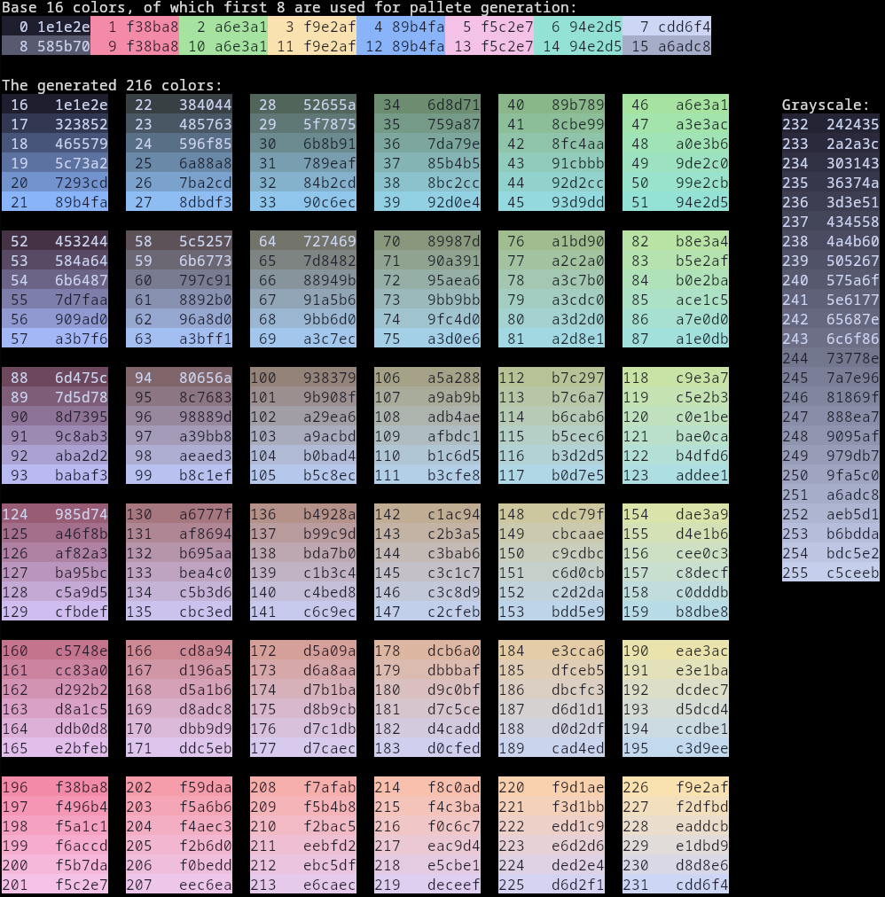
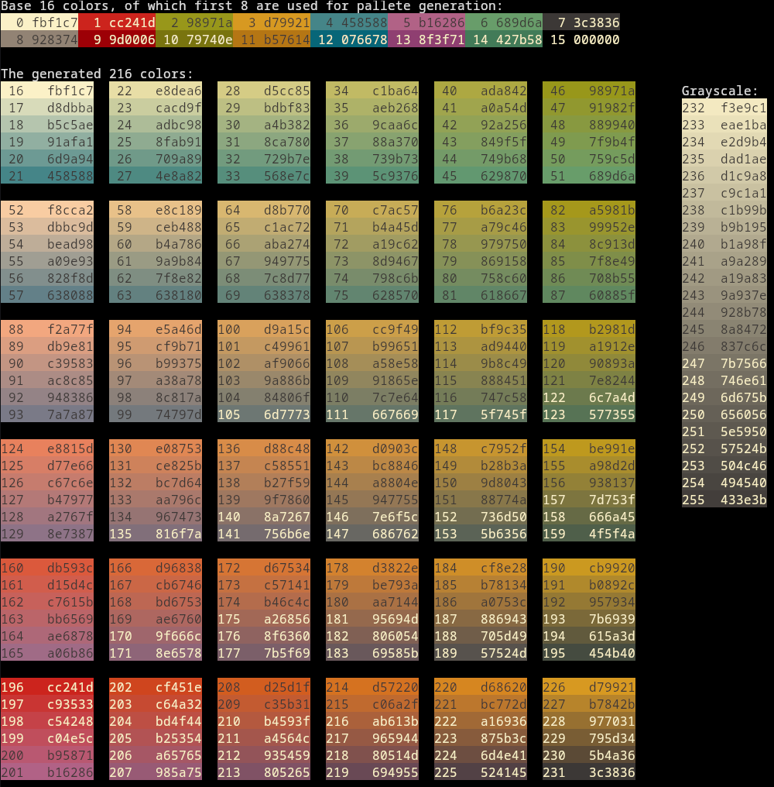

# Thync

S**ync** your **th**emes with a single file!

Automatically generates theme files for all your programs. Provided the base 8 colors, it generates the entire 256 color pallete.
Only the first 16 colors in the images are provided explicitly.




Note even though Catpuccin is dark and gruvbox is light, both have darker colors in the same regions, and the grayscale is facing the same way.

## Contents
- [Pre-use setup](#pre-use-setup)
- [Usage](#usage)
- [Config](config.md)
  - [Examples](examples/)
- [Installation](#installation)

---

## Pre-use setup
Before you can succesfully use this program, some setup is required. Ensure you set all colors in your main config files to variables (example for hyprland):

```lua
...
inactive_border = bg
...
```

and include a color file (where the variables will be defined):

```lua
require("hyprland-colors")
```

Then set this file as the path inside the [theme config file](config.md#configuration-files):

```conf
...
[hyprland]
path = "path/to/hprland-colors.lua"
...
```

---

## Usage

`thync [options] <color-file-name> <output-dir>`

First argument that doesn't belong to any option goes to `<color-file-name>`, the second to `<output-dir>`. `<output-dir>` defaults to local config folder, checks are performed in order:
 1. $XDG_CONFIG_HOME
 2. $HOME/.config

Options:

|Option|Description|
|---|---|
|-o \<output-dir>  | Override output directory|
|-f \<file-name>   | Color config path|
|--preview         | Prints the generated colors |

---

## Config

See [config.md](config.md)

### Examples

Examples are provided in the [examples](examples/) folder.

## Installation

Clone the repository

```bash
git clone https://github.com/loytech825/thync.git
```

Go into the repo folder and create a folder called build, and go into build

```bash
cd thync
mkdir build
cd build
```

Build the project with cmake, and install the program with make

```bash
cmake ..
cmake --build .
sudo make install
```